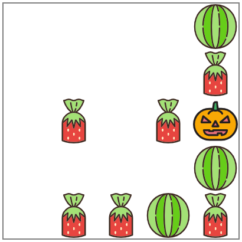
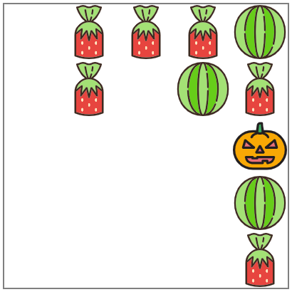
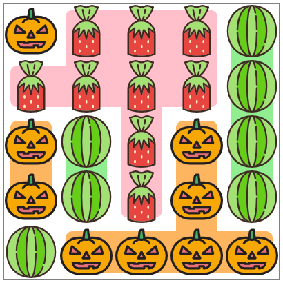

# AHC015
## 問題文を読み解く
$10\times10$のマス目に100個のキャンディーが配置される。  
キャンディは3種類の味があり、配置されるキャンディの種類の順番は事前に与えられる。
一方で、キャンディが配置される位置はその時点での空いている位置からランダムに選ばれ、操作の後に与えられる。

配置されるたびに前後左右に箱を傾け、  
> 
> 図のように、前に傾けると上にキャンディが寄る。
> 


同じ味のキャンディが集まっていると高得点。  


## ビジュアライザを読み解く


ビジュアライザには
- 入力をまとめる構造体
- 入力、出力の受け取り関数
- 盤面を表す構造体
- スコア計算の関数
- （その他ビジュアライズ用のあれこれ）

が書かれています。
どんな戦法で戦うにしろスコア計算は必須ですね！？
さらに、問題文だけよりも、問題文とコードを両方読むほうが理解が深まりますね。深まりますよね？今の所、問題文で(~~数式とかは読み飛ばしつつ~~)概要を掴んだ後、ビジュアライザのコードを一行ずつ追っていくのが題意を理解する最短ルートです、私は…

というわけでビジュアライザを読んでみましょう
ローカルテスタのzipファイルを解凍すると
```
tools
├── Cargo.lock
├── Cargo.toml
├── README.html
├── README.md
├── in
│   └── 0000.txt ~ 0099.txt
├── seeds.txt
└── src
    ├── bin
    │   ├── gen.rs
    │   └── vis.rs
    └── lib.rs // これを読む
```
このようにファイルが展開されます。読むべきは`tools/src/lib.rs`です！
#### lib.rsの解説


##### ~38行目 ライブラリのインポート、マクロ
使うライブラリの指定と頻用マクロについて。私もよくわかっていません。
`SetMinMax` : chmin, chmaxが書いてある。ビジュアライザに書いてあることが多いけど、使われているのは見たこと無い。多分便利なんでしょう。便利なんですか？
`macro rules! mat` : 二次元以上の配列の初期化マクロ。

##### 40~43行目 定数と型の定義
```Rust
40 pub const N: usize = 10; // 箱の一辺の長さ
41 pub const M: usize = 3;  // 飴の種類の数
42
43 pub type Output = Vec<char>;
```
##### 45行目~97行目　入力と出力の受け取り

この辺りをコピペすると簡単に入力を受け取ってInput構造体にまとめてくれることが多いのですが、
今回は**インタラクティブ形式**(こちらの出力に合わせて入力が与えられる)のため、そのままだと使えません…


```Rust
45 #[derive(Clone, Debug)]
46 pub struct Input {
47    pub fs: Vec<usize>,  // 飴の種類の配列
48    pub ps: Vec<usize>,  // 飴の場所の配列
49 }
50
51 impl std::fmt::Display for Input {  // pythonで言う__str__の実装
52     fn fmt(&self, f: &mut std::fmt::Formatter<'_>) -> std::fmt::Result {
53         for i in 0..self.fs.len() {
54             if i > 0 {
55                 write!(f, " ")?;
56             }
57             write!(f, "{}", self.fs[i])?;
58         }
59         writeln!(f)?;
60         for &p in &self.ps {
61             writeln!(f, "{}", p)?;
62         }
63         Ok(())
64     }
65 }
66 
```
この実装のおかげでprintln!("{}", input)すると入力を確認することができるんですね〜

``` Rust
67 pub fn parse_input(f: &str) -> Input {
68     let f = proconio::source::once::OnceSource::from(f);
69     input! {
70         from f,
71         fs: [usize; N * N],
72         ps: [usize; N * N],
73     }
74     Input { fs, ps }
75 }
76 
```
本来はここを変更して(以下のコード)
``` Rust
pub fn parse_input(/* f: &str */) -> Input {
    // let f = proconio::source::once::OnceSource::from(f);
    input! {
        // from f,
        fs: [usize; N * N],
        ps: [usize; N * N],
    }
    Input { fs, ps }
}
```
そのまま本番も入力を受け取ることができるコンテストもあります！今回は無理です

今読んでいるのはビジュアライザのコードなので、出力も受け取らなければならないです。
問題を解くのにはあまり関係ありませんね。
以下が出力の受け取りの部分です。
``` Rust
77 fn read(v: &str) -> Result<char, String> {
78     if v.len() != 1 {
79         Err(format!("Illegal output: {}", v))
80    } else {
81         Ok(v.chars().next().unwrap())
82    }
83 }
84 
85 pub fn parse_output(_input: &Input, f: &str) -> Result<Output, String> {
86     let tokens = f.lines();
87     let mut out = vec![];
88     for v in tokens {
89         let v = v.trim();
90         if v.len() == 0 {
91             continue;
92         }
93         out.push(read(v)?);
94     }
95     Ok(out)
96 }
97 
```

##### 98行目 ~ 197行目　状態を表す構造体
ビジュアライザを読むメインパートの一つです。
今回であれば、キャンディを入れる箱の状態を持つ構造体ですね。
どんな状態、機能を持たせるとスコア計算に便利か、の参考になりますし、
このコードをもとにして必要な状態を追加していくことが多いです。

``` Rust
98  #[derive(Clone, Debug)] // state.clone()で複製できるように、debug出力できるように
99  pub struct State {
100     pub fs: Vec<usize>,  // 飴の種類の配列
101     pub ps: Vec<usize>,  // 飴の位置の配列
102     pub board: Vec<Vec<usize>>,  // 箱の状態を表す二次元配列
103     pub t: usize,  // 何ターン目
104     pub last: (usize, usize),  // 最後に置かれた飴の位置
105 }
106 
```
今回はpsが最初から与えられないのでコードを変更する必要がありますね。

``` Rust
107 impl State {
108     pub fn new(input: &Input) -> Self {
109         let mut board = mat![0; N; N];
110         let last = ((input.ps[0] - 1) / N, (input.ps[0] - 1) % N);
111         board[last.0][last.1] = input.fs[0];
112         Self {
113             fs: input.fs.clone(),
114             ps: input.ps.clone(),
115             board,
116             t: 0,
117             last,
118         }
119     }
```

``` Rust
120     pub fn apply_move(&mut self, dir: char) -> Result<(), String> {
121         match dir {
122             'L' => {
123                 for i in 0..N {
124                     let mut k = 0;
125                     for j in 0..N {
126                         if self.board[i][j] != 0 {
127                             self.board[i][k] = self.board[i][j];
128                             if k != j {
129                                 self.board[i][j] = 0;
130                             }
131                             k += 1;
132                         }
133                     }
134                 }
135             }
```
行ごとに左端から箱の座標を見ていって、飴を見つけ次第左から順番に並べていくコードになっていますね。
```
self.board[i] = [0, 0, 0, 0, 0, 0, 0, 1, 2, 3];
```
とすると`j == 7`のとき`k == 0`で
```
[1, 0, 0, 0, 0, 0, 0, 0, 2, 3]
```
`j == 8`で`k == 1`になり以下
```
[1, 2, 0, 0, 0, 0, 0, 0, 0, 3]
```
`j == 9`で`k == 2`で左に寄せ終わります。
```
[1, 2, 3, 0, 0, 0, 0, 0, 0, 0]
```
寄せる方向がRだと右から見ていってますね。
B(後ろ)、F(前)も行列を変えただけで同様なので飛ばします。
``` Rust
136             'R' => {
137                 for i in 0..N {
138                     let mut k = N - 1;
139                     for j in (0..N).rev() {
140                         if self.board[i][j] != 0 {
141                             self.board[i][k] = self.board[i][j];
142                             if k != j {
143                                 self.board[i][j] = 0;
144                             }
145                             k -= 1;
146                         }
147                     }
148                 }
149             }
```


`FBRL`以外の引数を受け取るとエラーを返します

``` Rust
178             _ => {
179                 return Err(format!("Illegal output: {}", dir));
180             }
181         }
```
以下はターン終了後の処理です。
ターンを進め、次に与えられる位置に次の種類の飴を置いています。
これは実装を変えなければいけなそうですね。
``` Rust
182         self.t += 1;
183         let mut p = 0;
184         for i in 0..N {
185             for j in 0..N {
186                 if self.board[i][j] == 0 {
187                     p += 1;
188                     if p == self.ps[self.t] {
189                         self.board[i][j] = self.fs[self.t];
190                         self.last = (i, j);
191                     }
192                 }
193             }
194         }
195         Ok(())
196     }
197 }
198 
```


260 ~ 432行目 : 3種のキャンディの画像がSVG形式で埋め込まれている

